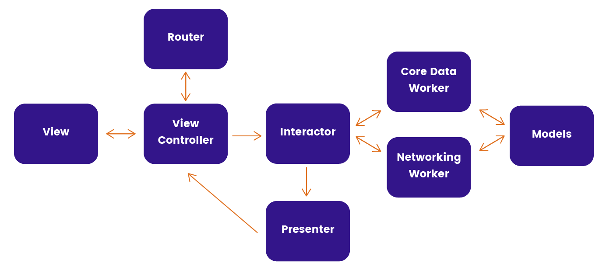

# VIPSwift
This project was developed to demonstrate the usage of Clean Architecture in Swift. This project allows the user to search for repositories by query using the GitHub API. This project contains Unit Tests.
# Demo

# VIP
This project is based on the VIP (View-Interactor-Presenter) architecture that could be represented by this chart.

## View
The View layer is responsible for handling all the layout related code, such as displaying the data and ask for the data.
## Interactor
The Interactor is responsible for listen the requests from the view, handle all the business logic and sending the data to the presenter.
## Presenter
The presenter is responsible for receiving the data from the interecator, transform it on a view representative way such as a ViewModel and send the information to the View.
## Router
The Router is responsible for handling the navigation between the scenes.
## Woker
The Worker is responsible for calling services, such as calling an API or a local Storage.

# Instalation

Make sure you have a recent version of [cocoapods](https://cocoapods.org) installed. If not,
Just run

    sudo gem install cocoapods

Then run

    pod install
